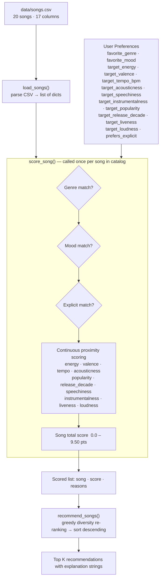
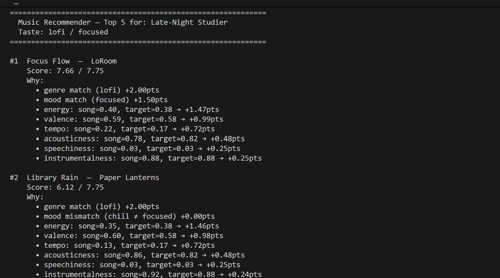
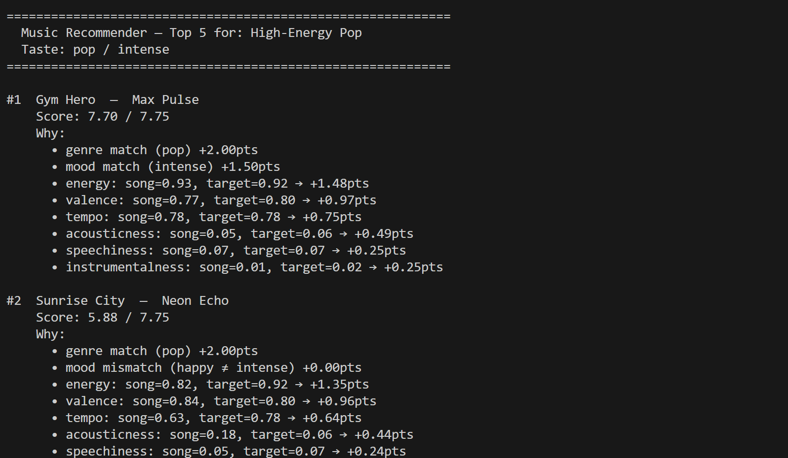
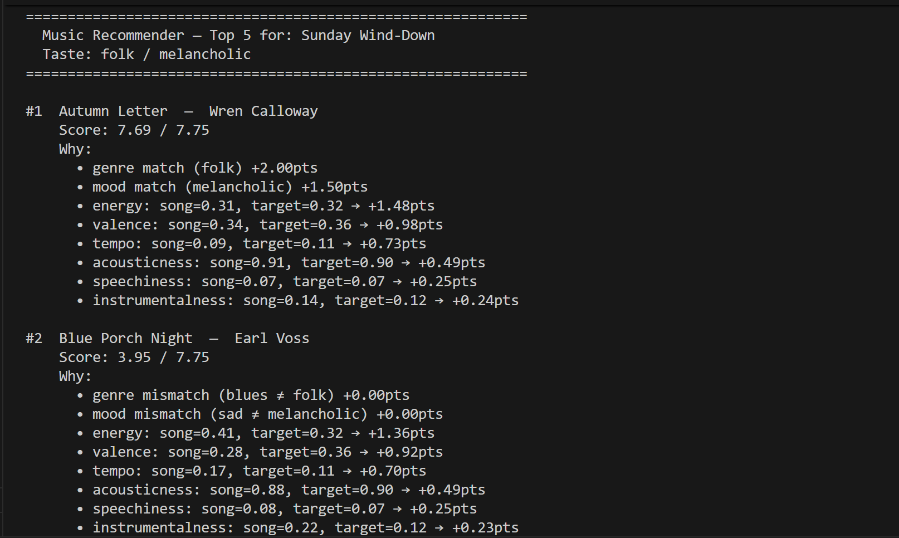
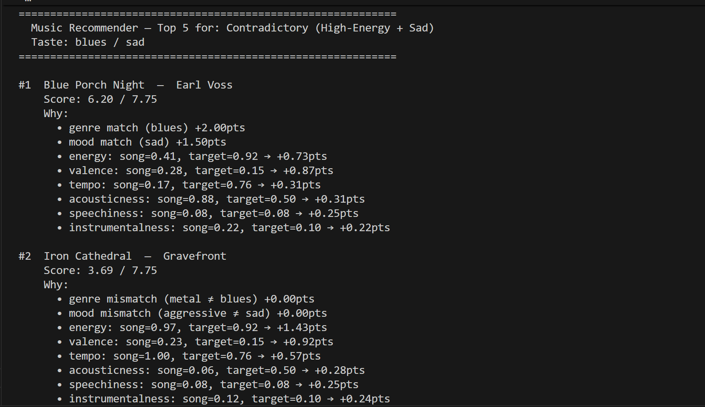
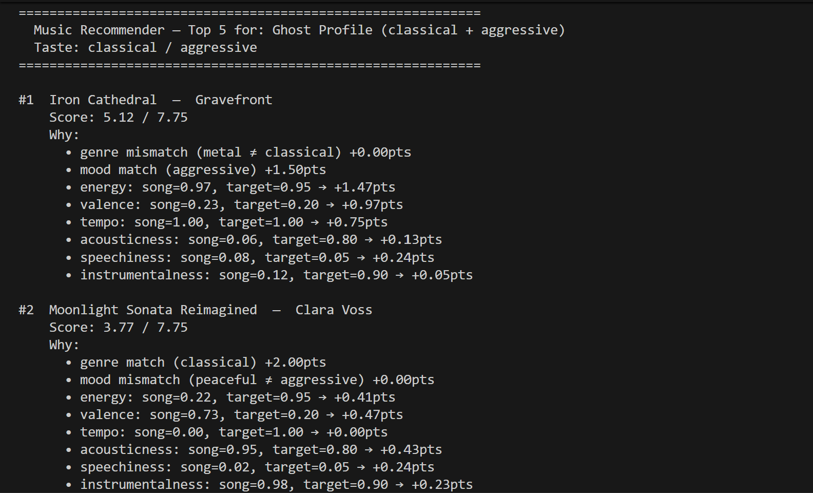
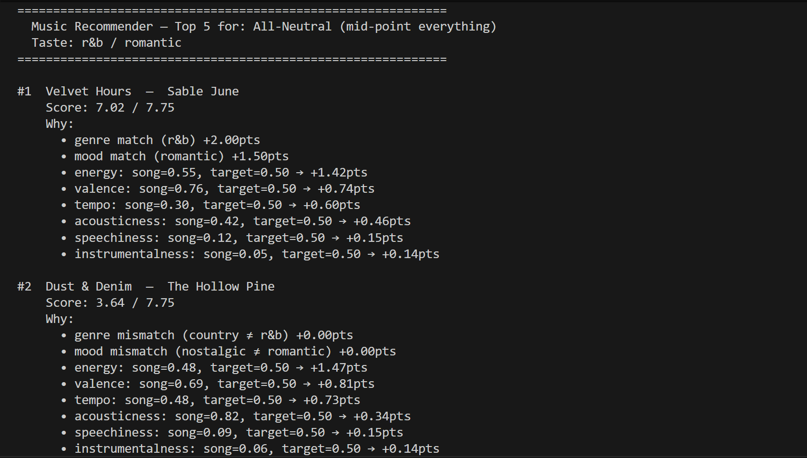

# Music Recommender Simulation

A content-based music recommender that scores songs against a user taste profile and returns the closest matches. It loads a 20-song catalog from `data/songs.csv`, computes a weighted similarity score for each song, and ranks them to produce a short list of recommendations with full per-feature explanations.

---

## How The System Works

### Content-Based Filtering

Real-world recommenders like Spotify combine collaborative filtering (users with similar taste) with content-based filtering (audio attributes). This simulation focuses entirely on the content-based side. Rather than modeling other users' behavior, it compares each song's attributes directly against a user's stated preference profile.

It prioritizes **proximity over magnitude** — a song is not better because it has higher energy, it is better because its energy is *closer to what this specific user wants*. Genre and mood are weighted most heavily as hard taste boundaries, then energy, valence, tempo, and acousticness act as continuous similarity signals.

---

### Song Features

| Feature | Type | Max Points | Role in Scoring |
|---|---|---|---|
| `genre` | Categorical | **+2.00** | Hard taste boundary — binary match |
| `mood` | Categorical | **+1.50** | Listening intent — binary match |
| `energy` | Float (0–1) | **+1.50** | Core vibe signal — proximity scored |
| `valence` | Float (0–1) | **+1.00** | Emotional tone dark→bright — proximity scored |
| `tempo_bpm` | Integer | **+0.75** | Activity context — normalized then proximity scored |
| `acousticness` | Float (0–1) | **+0.50** | Organic vs. electronic texture — proximity scored |
| `popularity` | Integer (0–100) | **+0.50** | How well-known the song is — normalized proximity |
| `release_decade` | Integer | **+0.50** | Era preference (1970→0.0 … 2020→1.0) |
| `speechiness` | Float (0–1) | **+0.25** | Vocal density sung→rapped — proximity scored |
| `instrumentalness` | Float (0–1) | **+0.25** | No-vocals preference — proximity scored |
| `liveness` | Float (0–1) | **+0.25** | Studio vs. concert-like feel |
| `loudness_norm` | Float (0–1) | **+0.25** | Quiet vs. loud production |
| `explicit` | Binary (0/1) | **+0.25** | Explicit content preference — binary match |
| | | **9.50 total** | Maximum possible score |

---

### Algorithm Recipe — Point Budget

**Categorical features** (binary: match = full points, no match = 0):

```
genre match  → +2.00 pts    (hard taste boundary)
mood match   → +1.50 pts    (listening intent)
explicit     → +0.25 pts    (binary preference match)
```

**Continuous features** (proximity: `earned = max_pts × (1 − |user_target − song_value|)`):

```
energy           → up to +1.50 pts
valence          → up to +1.00 pts
tempo (normed)   → up to +0.75 pts
acousticness     → up to +0.50 pts
popularity       → up to +0.50 pts   (divided by 100 before comparison)
release_decade   → up to +0.50 pts   (mapped: 1970→0.0, 2020→1.0)
speechiness      → up to +0.25 pts
instrumentalness → up to +0.25 pts
liveness         → up to +0.25 pts
loudness         → up to +0.25 pts
─────────────────────────────────────
Max total score         9.50 pts
```

Proximity scoring means a value of `0.0` is as valid as `1.0` — closeness to the user's target earns points, not having a "high" value. `tempo_bpm` is normalized to `[0, 1]` via `max(0, min(1, (bpm − 60) / 92))` before comparison.

**Ranking Rule:** Score every song → sort by score descending → return top K with explanation strings.

---

### Scoring Modes

Four ranking strategies are available, selectable by name:

| Mode | What it emphasizes |
|---|---|
| `balanced` | Default — all features weighted as above |
| `genre_first` | Genre weight doubled (4.00); continuous features halved |
| `vibe_first` | Energy (3.50) and valence (2.50) dominate; genre softened to 0.50 |
| `discovery` | Popularity weight goes negative (−0.30) to surface deep cuts; release decade boosted |

---

### Diversity Penalty

`recommend_songs()` accepts optional `artist_penalty` and `genre_penalty` parameters (both default to `0.0`). When set, the function uses greedy re-ranking: at each selection step it subtracts the penalty from any candidate whose artist or genre is already in the selected list. This prevents the top results from being dominated by one artist or genre.

---

### Data Flow Diagram



---

## Sample Output

Running `python src/main.py` prints recommendations for all 6 profiles, a scoring mode comparison, visual summary tables, and a diversity penalty demo.

### Standard Profiles

**Profile 1 — Late-Night Studier** (`lofi / focused`)



**Profile 2 — High-Energy Pop** (`pop / intense`)



**Profile 3 — Sunday Wind-Down** (`folk / melancholic`)



### Adversarial / Edge-Case Profiles

**Profile 4 — Contradictory** (`blues / sad` + high energy 0.92)
Tests whether the system handles a user who wants intense energy but a sad mood — two traits that rarely co-exist in the catalog.



**Profile 5 — Ghost Profile** (`classical / aggressive`)
No song in the catalog matches either category. Ranking falls entirely on continuous proximity — reveals the "floor" behavior.



**Profile 6 — All-Neutral** (`r&b / romantic`, all continuous targets at 0.5)
Tests whether near-tie continuous scores produce a meaningful ranking or a jumble.



---

## Getting Started

### Setup

1. Create a virtual environment (optional but recommended):

   ```bash
   python -m venv .venv
   source .venv/bin/activate      # Mac / Linux
   .venv\Scripts\activate         # Windows
   ```

2. Install dependencies:

   ```bash
   pip install -r requirements.txt
   ```

3. Run the recommender:

   ```bash
   python -m src.main
   ```

### Running Tests

```bash
pytest
```

---

## Experiments

### Experiment 1 — Weight Shift: Halve Genre, Double Energy

**Change:** `genre` reduced from `2.00` → `1.00`; `energy` raised from `1.50` → `3.00`.

**Result:** The #1 result did not change for any of the 6 profiles. Songs that already matched genre + mood + energy pulled further ahead — the experiment made the system more certain, not more varied. For the Contradictory profile, the gap between #1 (correct genre/mood, low energy) and #2 (wrong genre, perfect energy) shrank from ~2 pts to ~0.8 pts. The original weights were reverted because the change just shifted dominance from genre to energy without improving recommendation quality.

**Key insight:** In a 20-song catalog, weight tuning has minimal effect because there is insufficient within-genre competition for continuous features to matter. You need enough songs per category for different weights to actually compete.

### Experiment 2 — Adversarial Profiles

- **Contradictory** (blues/sad + energy 0.92): Blue Porch Night ranked #1 due to genre+mood match even though its energy (0.41) was far from the target (0.92). The combined categorical bonus (+3.50 pts) outweighed the energy penalty — confirms the system prioritizes taste labels over vibe when they conflict.
- **Ghost Profile** (classical/aggressive — no catalog match): Iron Cathedral (metal/aggressive) ranked #1 surviving on mood match (+1.50) and near-perfect energy/valence proximity. Shows graceful degradation: no genre match means continuous features decide.
- **All-Neutral** (r&b/romantic, all targets at 0.5): Velvet Hours ranked #1 by a large margin purely because it is the only r&b/romantic song. Confirms the filter bubble: one matching song per genre makes the categorical bonus an automatic winner.

---

## Limitations

- **Genre filter bubble:** 12 of 14 genres have only one song. Any user whose genre is not lofi or pop gets that one song as an automatic #1 regardless of how poorly its other features match.
- **Catalog skews against rap listeners:** 16 of 20 songs have speechiness below 0.10. A user targeting high speechiness will find almost no close matches.
- **Energy asymmetry:** Catalog average energy is ~0.63, skewing high. Low-energy users (target < 0.30) have fewer songs to match against and tend to score lower overall.
- **Single-genre user model:** Each profile holds exactly one favorite genre. Listeners who genuinely enjoy two genres cannot be represented.
- **Static profiles:** The system has no implicit feedback. It does not update from skips, replays, or session length.

See [model_card.md](model_card.md) for the full bias and evaluation analysis.

---

## Reflection

See [reflection.md](reflection.md) for profile pair comparisons and analysis of where the system succeeds and fails.

See [model_card.md](model_card.md) Section 10 for a personal reflection on the engineering process, what the weight-shift experiment revealed, and what would be tried next.
