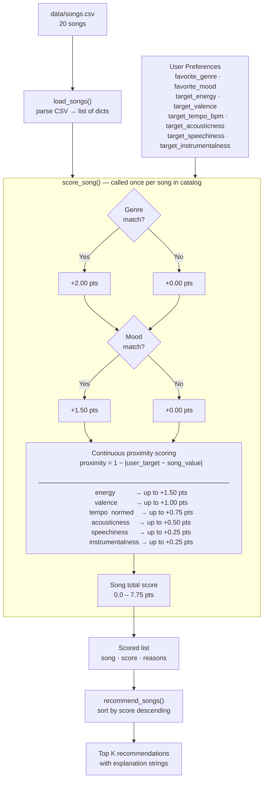
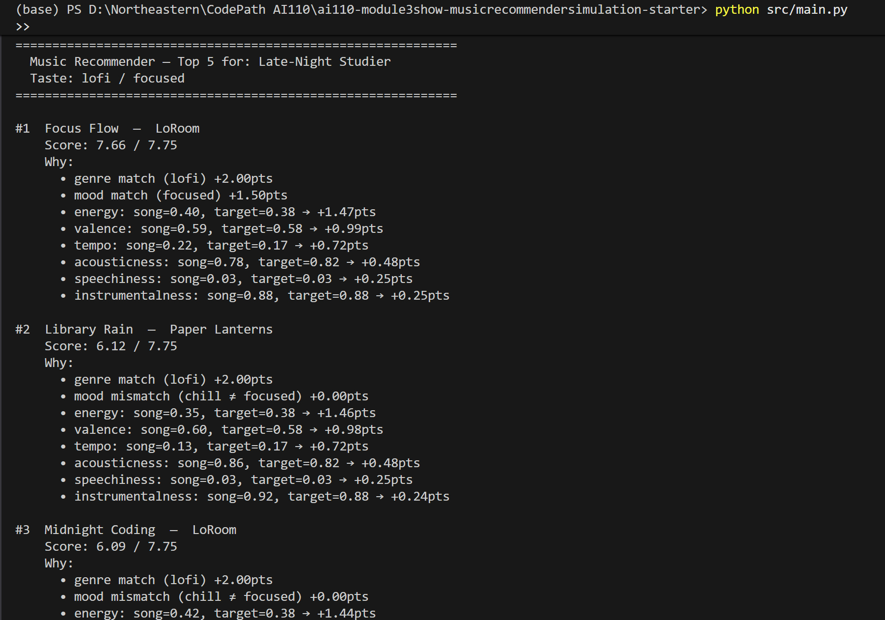

# 🎵 Music Recommender Simulation

## Project Summary

In this project you will build and explain a small music recommender system.

Your goal is to:

- Represent songs and a user "taste profile" as data
- Design a scoring rule that turns that data into recommendations
- Evaluate what your system gets right and wrong
- Reflect on how this mirrors real world AI recommenders

This simulation builds a content-based music recommender that scores songs against a user taste profile and returns the closest matches. It loads a small catalog from `data/songs.csv`, computes a weighted similarity score for each song, and ranks them to produce a short list of recommendations.

---

## How The System Works

### How Real-World Recommenders Work — and What This Version Prioritizes

Real-world music recommenders like Spotify and YouTube use hybrid systems that combine two strategies: **collaborative filtering**, which surfaces songs loved by users with similar taste, and **content-based filtering**, which matches songs based on their audio attributes. At scale, these platforms layer in implicit behavioral signals — skips, replays, session length — and deep neural networks that encode both user behavior and song features into shared embedding spaces. The result is a system that can find unexpected connections across genres and contexts while still respecting a listener's core preferences.

This simulation focuses entirely on the **content-based side**. Rather than modeling other users' behavior, it compares a song's attributes directly against a user's stated preference profile. It prioritizes **proximity over magnitude** — a song is not better because it has higher energy, it is better because its energy is *closer to what this specific user prefers*. The system weights genre and mood most heavily (as hard taste boundaries), then uses energy, valence, tempo, and acousticness as continuous similarity signals. This keeps the logic transparent and directly inspectable, which makes it a useful tool for understanding what real recommenders are optimizing for beneath their black-box surfaces.

---

### `Song` Features

Each song in the catalog is represented with the following attributes:

| Feature | Type | Max Points | Role in Scoring |
|---|---|---|---|
| `id` | Integer | — | Unique identifier, display only |
| `title` | String | — | Display only |
| `artist` | String | — | Display only |
| `genre` | Categorical | **+2.00** | Hard taste boundary — binary match |
| `mood` | Categorical | **+1.50** | Listening intent — binary match |
| `energy` | Float (0–1) | **+1.50** | Core vibe signal — proximity scored |
| `valence` | Float (0–1) | **+1.00** | Emotional tone dark→bright — proximity scored |
| `tempo_bpm` | Integer | **+0.75** | Activity context — normalized then proximity scored |
| `acousticness` | Float (0–1) | **+0.50** | Organic vs. electronic texture — proximity scored |
| `speechiness` | Float (0–1) | **+0.25** | Vocal density sung→rapped — proximity scored |
| `instrumentalness` | Float (0–1) | **+0.25** | No-vocals preference — proximity scored |
| | | **7.75 total** | Maximum possible score |

---

### `UserProfile` Features

The user profile stores the listener's preferences using the same feature space as the song catalog, enabling direct comparison:

| Field | Type | Purpose |
|---|---|---|
| `name` | String | Identifies the user |
| `favorite_genre` | String | Matched against `song.genre` (categorical) |
| `favorite_mood` | String | Matched against `song.mood` (categorical) |
| `target_energy` | Float (0–1) | Target energy for proximity scoring |
| `target_valence` | Float (0–1) | Target emotional tone for proximity scoring |
| `target_tempo_bpm` | Integer | Target tempo in raw BPM — normalized before scoring |
| `target_acousticness` | Float (0–1) | Target texture preference for proximity scoring |
| `target_speechiness` | Float (0–1) | Target vocal density (default 0.05) |
| `target_instrumentalness` | Float (0–1) | Target no-vocals preference (default 0.05) |
| `target_danceability` | Float (0–1) | Stored for future use — not yet weighted |

---

### Algorithm Recipe — Point Budget

**Categorical features** (binary: match = full points, no match = 0):

```
genre match  → +2.00 pts    (hard taste boundary)
mood match   → +1.50 pts    (listening intent)
```

**Continuous features** (proximity: `earned = max_pts × (1 − |user_target − song_value|)`):

```
energy           → up to +1.50 pts   (most powerful vibe signal)
valence          → up to +1.00 pts   (emotional tone)
tempo (normed)   → up to +0.75 pts   (activity context)
acousticness     → up to +0.50 pts   (texture)
speechiness      → up to +0.25 pts   (vocal density)
instrumentalness → up to +0.25 pts   (no-vocals preference)
─────────────────────────────────────
Max total score         7.75 pts
```

Proximity scoring means a value of `0.0` is as valid as `1.0` — closeness to the user's target is what earns points, not having a "high" value. `tempo_bpm` is normalized to `[0, 1]` via `max(0, min(1, (bpm − 60) / 92))` before comparison.

**Ranking Rule:** Score every song → sort by score descending → return top K with explanation strings.

---

### Known Biases and Limitations

**1. Genre dominance over mood**
Genre carries +2.00 pts — the single largest budget item. A song that perfectly matches the user's mood, energy, and tempo but belongs to a different genre can never outscore a same-genre song that misses on mood. In practice this means a chill jazz track might rank above an equally chill folk track for a jazz-preferring user, even if the folk track matches every other feature more closely. Real-world systems avoid this by softening genre into a continuous similarity score rather than a hard binary match.

**2. Single-genre user model**
Each `UserProfile` holds exactly one `favorite_genre`. Listeners who genuinely enjoy two genres equally — lo-fi for studying and synthwave for commuting — cannot be represented. The system will always rank the off-genre tracks lower, no matter how well their other features align. This is a structural limitation of the data model, not the scoring math.

**3. Cold-start for new users**
Because every field in `UserProfile` must be set manually, a brand-new user with no listening history has no profile. Real recommenders bootstrap from onboarding questions or infer preferences from a few seed songs. This simulation skips that step entirely.

**4. Small and culturally narrow catalog**
All 20 songs were generated to cover technical feature diversity, not real cultural diversity. Artist names, lyrical themes, and cultural context are absent. A system trained on this catalog cannot reflect the real-world listening patterns of any particular community, demographic, or geography.

**5. No implicit feedback**
The system has no concept of skips, replays, or session length. A user who always skips intense songs would still receive them if their `UserProfile` was set up incorrectly. Real recommenders update continuously from implicit signals — this one is static until the profile dict is manually edited.

**6. Mood and genre labels are coarse**
The catalog uses a single word for mood (`chill`, `intense`, `happy`) and genre (`lofi`, `rock`, `pop`). These are broad buckets. Two songs labeled `chill` can feel completely different in practice, and the scoring rule treats them as identical on that axis. Subgenre hierarchies and multi-label mood tagging would reduce this flattening effect.

---

### Data Flow Diagram



---

## Sample Output

Running `python src/main.py` with the **Late-Night Studier** profile (`lofi / focused`) produces:



```
============================================================
  Music Recommender — Top 5 for: Late-Night Studier
  Taste: lofi / focused
============================================================

#1  Focus Flow  —  LoRoom
    Score: 7.66 / 7.75
    Why:
      • genre match (lofi) +2.00pts
      • mood match (focused) +1.50pts
      • energy: song=0.40, target=0.38 → +1.47pts
      • valence: song=0.59, target=0.58 → +0.99pts
      • tempo: song=0.22, target=0.17 → +0.72pts
      • acousticness: song=0.78, target=0.82 → +0.48pts
      • speechiness: song=0.03, target=0.03 → +0.25pts
      • instrumentalness: song=0.88, target=0.88 → +0.25pts

#2  Library Rain  —  Paper Lanterns
    Score: 6.12 / 7.75
    Why:
      • genre match (lofi) +2.00pts
      • mood mismatch (chill ≠ focused) +0.00pts
      • energy: song=0.35, target=0.38 → +1.46pts
      • valence: song=0.60, target=0.58 → +0.98pts
      • tempo: song=0.13, target=0.17 → +0.72pts
      • acousticness: song=0.86, target=0.82 → +0.48pts
      • speechiness: song=0.03, target=0.03 → +0.25pts
      • instrumentalness: song=0.92, target=0.88 → +0.24pts

#3  Midnight Coding  —  LoRoom
    Score: 6.09 / 7.75
    Why:
      • genre match (lofi) +2.00pts
      • mood mismatch (chill ≠ focused) +0.00pts
      • energy: song=0.42, target=0.38 → +1.44pts
      • valence: song=0.56, target=0.58 → +0.98pts
      • tempo: song=0.20, target=0.17 → +0.73pts
      • acousticness: song=0.71, target=0.82 → +0.45pts
      • speechiness: song=0.04, target=0.03 → +0.25pts
      • instrumentalness: song=0.85, target=0.88 → +0.24pts

#4  Coffee Shop Stories  —  Slow Stereo
    Score: 3.85 / 7.75
    Why:
      • genre mismatch (jazz ≠ lofi) +0.00pts
      • mood mismatch (relaxed ≠ focused) +0.00pts
      • energy: song=0.37, target=0.38 → +1.48pts
      • valence: song=0.71, target=0.58 → +0.87pts
      • tempo: song=0.33, target=0.17 → +0.63pts
      • acousticness: song=0.89, target=0.82 → +0.46pts
      • speechiness: song=0.04, target=0.03 → +0.25pts
      • instrumentalness: song=0.45, target=0.88 → +0.18pts

#5  Spacewalk Thoughts  —  Orbit Bloom
    Score: 3.83 / 7.75
    Why:
      • genre mismatch (ambient ≠ lofi) +0.00pts
      • mood mismatch (chill ≠ focused) +0.00pts
      • energy: song=0.28, target=0.38 → +1.35pts
      • valence: song=0.65, target=0.58 → +0.93pts
      • tempo: song=0.00, target=0.17 → +0.62pts
      • acousticness: song=0.92, target=0.82 → +0.45pts
      • speechiness: song=0.02, target=0.03 → +0.25pts
      • instrumentalness: song=0.97, target=0.88 → +0.23pts
```

**Why these results make sense:** Focus Flow is the only song in the catalog that is both `lofi` and `focused`, earning all 3.50 pts from the two categorical features. Library Rain and Midnight Coding are also lofi but have mood `chill`, costing them the +1.50 mood points — which explains the ~1.5 pt gap to #1. Coffee Shop Stories and Spacewalk Thoughts appear at the bottom because they miss the genre bonus entirely (+0.00 pts for genre), surviving only on their continuous feature proximity.

---

## Getting Started

### Setup

1. Create a virtual environment (optional but recommended):

   ```bash
   python -m venv .venv
   source .venv/bin/activate      # Mac or Linux
   .venv\Scripts\activate         # Windows

2. Install dependencies

```bash
pip install -r requirements.txt
```

3. Run the app:

```bash
python -m src.main
```

### Running Tests

Run the starter tests with:

```bash
pytest
```

You can add more tests in `tests/test_recommender.py`.

---

## Experiments You Tried

Use this section to document the experiments you ran. For example:

- What happened when you changed the weight on genre from 2.0 to 0.5
- What happened when you added tempo or valence to the score
- How did your system behave for different types of users

---

## Limitations and Risks

Summarize some limitations of your recommender.

Examples:

- It only works on a tiny catalog
- It does not understand lyrics or language
- It might over favor one genre or mood

You will go deeper on this in your model card.

---

## Reflection

Read and complete `model_card.md`:

[**Model Card**](model_card.md)

Write 1 to 2 paragraphs here about what you learned:

- about how recommenders turn data into predictions
- about where bias or unfairness could show up in systems like this


---

## 7. `model_card_template.md`

Combines reflection and model card framing from the Module 3 guidance. :contentReference[oaicite:2]{index=2}  

```markdown
# 🎧 Model Card - Music Recommender Simulation

## 1. Model Name

Give your recommender a name, for example:

> VibeFinder 1.0

---

## 2. Intended Use

- What is this system trying to do
- Who is it for

Example:

> This model suggests 3 to 5 songs from a small catalog based on a user's preferred genre, mood, and energy level. It is for classroom exploration only, not for real users.

---

## 3. How It Works (Short Explanation)

Describe your scoring logic in plain language.

- What features of each song does it consider
- What information about the user does it use
- How does it turn those into a number

Try to avoid code in this section, treat it like an explanation to a non programmer.

---

## 4. Data

Describe your dataset.

- How many songs are in `data/songs.csv`
- Did you add or remove any songs
- What kinds of genres or moods are represented
- Whose taste does this data mostly reflect

---

## 5. Strengths

Where does your recommender work well

You can think about:
- Situations where the top results "felt right"
- Particular user profiles it served well
- Simplicity or transparency benefits

---

## 6. Limitations and Bias

Where does your recommender struggle

Some prompts:
- Does it ignore some genres or moods
- Does it treat all users as if they have the same taste shape
- Is it biased toward high energy or one genre by default
- How could this be unfair if used in a real product

---

## 7. Evaluation

How did you check your system

Examples:
- You tried multiple user profiles and wrote down whether the results matched your expectations
- You compared your simulation to what a real app like Spotify or YouTube tends to recommend
- You wrote tests for your scoring logic

You do not need a numeric metric, but if you used one, explain what it measures.

---

## 8. Future Work

If you had more time, how would you improve this recommender

Examples:

- Add support for multiple users and "group vibe" recommendations
- Balance diversity of songs instead of always picking the closest match
- Use more features, like tempo ranges or lyric themes

---

## 9. Personal Reflection

A few sentences about what you learned:

- What surprised you about how your system behaved
- How did building this change how you think about real music recommenders
- Where do you think human judgment still matters, even if the model seems "smart"

